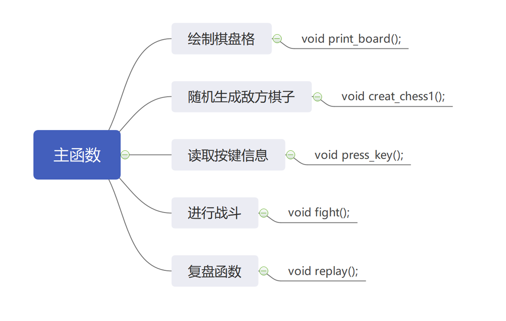

# 动物棋小游戏

## 游戏规则

游戏规则:   您与计算机各自拥有14枚动物棋，涉及的动物有象 (E)、虎 (T)、狮 (L)、狼 (W)、狗 (D)、猫 (C) 和鼠 (M) 它们拥有各自的等级，等级按此顺序从高到底。游戏开始时，对战的双方各有每种动物两只；在棋盘的下方显示您每种动物的数量，敌方的棋子随机地排放在棋盘上某些方格内，对应的方格中显示一个‘●’字符，您不知相应的方格中是何种动物。您可使用上、下、左、右键移动黑色方块到所需的方格中，按下代表动物的字母键将该动物落子到该方格中。如果敌方的动物与您方的动物处于相邻的方格中，则高等级的动物会消灭低等级的动物，但鼠会消灭象。若左右两边同时有敌方动物，则先与左侧动物进行对战，再与右侧动物对战。被消灭的动物从棋盘中消失，如果是您的动物被敌方消灭，则棋盘下方相应动物的数量被更新。您方也可以将黑色方块移动到己方棋子所在的方格，按下空格键选中该棋子，然后使用上、下、左、右键移动到合适的方格中后，再次按下空格键将该棋子重新落子到目标方格中。以这样的方式一直进行游戏，直到一方的动物被另一方完全消灭，则还有剩余棋子的一方获胜。如果最后双方均只有一枚棋子剩余，而且是相同的动物，则平局。

## 代码整体设计思路

## 棋子数据存储思路

## 核心函数

